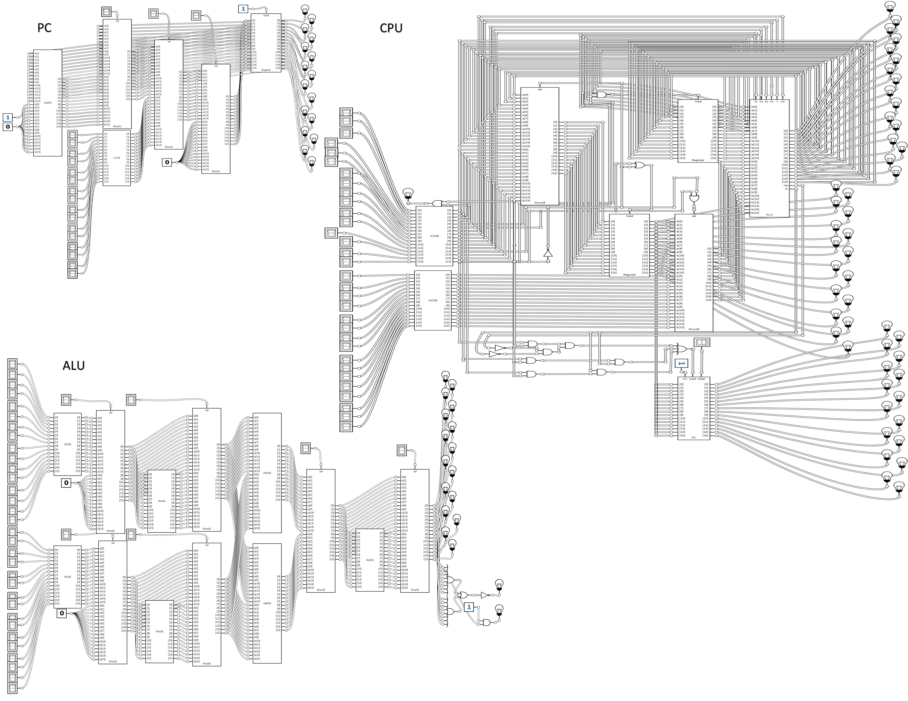

# Nand2Tetris

These are the projects I implement as my project solutions for the [Nand2Tetris](https://www.nand2tetris.org/) online course. In this course, the projects involved implementing a 16-bit computer (almost) from scratch -- first the hardware, followed by the hardware. Please read below for details of all the projects (computer hardware/software) implemented:

## Hardware Projects

| Week | Hardware Chips | Details |
| :---         |     :---:      |          ---: |
| [1](projects/01/)   | [And](projects/01/And.hdl), [And16](projects/01/And16.hdl), [Not](projects/01/Not.hdl), [Not16](projects/01/Not16.hdl), [Or](projects/01/Or.hdl), [Or8Way](projects/01/Or8Way.hdl), [Or16](projects/01/Or16.hdl), [DMux](projects/01/DMux.hdl), [DMux4Way](projects/01/DMux4Way.hdl), [DMux8Way](projects/01/DMux8Way.hdl), [Mux](projects/01/Mux.hdl), [Mux16](projects/01/Mux16.hdl), [Mux4Way16](projects/01/Mux4Way16.hdl), [Mux8Way16](projects/01/Mux8Way16.hdl), [Xor](projects/01/Xor.hdl)    | Implemented 1-bit and 16-bit version of logic gates, multiplexer and demultiplexer    |
| [2](projects/02/)   | [Inc16](projects/02/Inc16.hdl), [Add16](projects/02/Add16.hdl), [HalfAdder](projects/02/HalfAdder.hdl), [FullAdder](projects/02/FullAdder.hdl), [ALU](projects/02/ALU.hdl)     | Implemented 16-bit arithmetic chips, Half and Full Adder as well as Arithmetic Logic Unit (ALU) |
| [3](projects/03/)   | [Bit](projects/03/a/Bit.hdl), [Register](projects/03/a/Register.hdl), [PC](projects/03/a/PC.hdl), [RAM8](projects/03/a/RAM8.hdl), [RAM8](projects/03/a/RAM8.hdl), [RAM64](projects/03/a/RAM64.hdl)   | Implemented 1-bit and 16-bit register, Program Counter, different sizes of RAM (8, 64, 512, 4K, 16K each of 16-bit registers)    |
| [5](projects/03/)   | [Memory](projects/05/Memory.hdl), [CPU](projects/05/CPU.hdl), [Computer](projects/05/Computer.hdl)| Impletemented memory (RAM+Screen+Keyboard), CPU based on Harvard architecture with fetch-execute cycles based on 16-bit instruction, control and memory bus, Computer (using memory, CPU and built-in ROM)    |

## Software Projects

| Week | Software | Details |
| :---         |     :---:      |          ---: |
| [4](projects/04/)   | [Fill](projects/04/a/Fill.asm), [Mult](projects/04/a/mult.asm)     | Wrote assembly programs which (1) Fills screen based on keyboard input and (2) Multiplies two numbers and stores the results in RAM    |
| [6](projects/06/)   |      |  |

